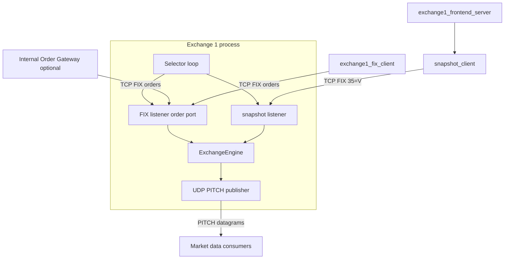

# Exchange 1: System Design and Peripherals

A design document suitable for turning into lecture slides. Covers the simulated venue (`exchange1.py` + this package), protocols, matching engine, and surrounding tools.

---

## 1. Purpose and scope

### 1.1 What Exchange 1 is

**Exchange 1** is an educational **simulated electronic exchange**. It behaves like a minimal production venue for a class project:

- It **maintains limit-order books** per symbol, **matches** aggressive orders against resting liquidity, and **emits market-data events** describing visible book changes and trades.
- It accepts **orders over TCP** using a simplified **FIX 4.2** encoding (SOH-delimited `tag=value` messages with a checksum).
- It separates **order entry** from **read-only book snapshots** onto **two different TCP ports**.

### 1.2 What it is not

- It is **not** a full FIX session with logon, heartbeats, sequence number recovery, or multiple venues in one process.
- It does **not** implement regulatory or production-grade risk (the Internal Order Gateway and other layers may add checks).
- The **UDP feed** is **not** the same wire format as **Exchange 2** in this repo (relevant if a single market-data normalizer assumes only one layout).

### 1.3 Teaching goals the design supports

- **Separation of transports:** fire-and-forget **UDP** for public ticks vs reliable **TCP** for order flow.
- **Protocol framing:** FIX-like messages delimited by **checksum**, buffered on byte streams.
- **Matching logic:** price-time priority, limit vs market, IOC vs day.
- **Order entry vs data:** why **35=V** (MarketDataRequest) can live on a **different socket** than **35=D** (NewOrderSingle).

---

## 2. High-level architecture

### 2.1 Single-process venue

All Exchange 1 core logic runs in **one Python process** ([`exchange1.py`](../exchange1.py)) that:

1. Owns a **UDP socket** used only to **publish** PITCH-like lines.
2. Listens on **two TCP ports**: **FIX orders** and **snapshots**.
3. Uses an **event loop** (`selectors`) so many TCP clients can connect without blocking each other.

### 2.2 Logical diagram

Ports and hosts are defined in [`config.py`](../config.py) (e.g. UDP `5001`, FIX `6001`, snapshot `6101` on `127.0.0.1` by default).

### 2.3 Configuration touchpoint

| Setting | Role |
|--------|------|
| `EXCHANGE1_UDP_HOST` / `EXCHANGE1_UDP_PORT` | **Destination** for PITCH datagrams (subscribers bind/listen per your topology). |
| `EXCHANGE1_FIX_HOST` / `EXCHANGE1_FIX_PORT` | **Order entry** TCP (IOG or direct FIX client). |
| `EXCHANGE1_SNAPSHOT_HOST` / `EXCHANGE1_SNAPSHOT_PORT` | **Snapshot** TCP for **35=V**; UI and tooling use this. |

---

## 3. External interfaces (three faces of the venue)

### 3.1 UDP: simplified PITCH market data

**Direction:** Exchange 1 → subscribers (UDP **sendto**).

**Message shape (UTF-8 text, pipe-separated):**

`SequenceNumber | TimestampMs | MessageType | payload...`

**Message types implemented:**

| Type | Meaning |
|------|---------|
| **S** | **System** event (e.g. open). |
| **A** | **Add** — visible limit order rests on book; symbol, side, qty, price. |
| **E** | **Execute** — trade against a resting **order id**; subscribers often map id → symbol. |
| **X** | **Cancel** — shares removed/reduced for an order id. |

**Pricing:** In PITCH payloads, prices are **fixed-point integers** = dollars × **10 000**. FIX tag **44** uses **decimal strings** instead.

See also [docs/exchange1.md](../docs/exchange1.md).

### 3.2 TCP: FIX order entry

**Role:** Orders that change the book.

| Tag 35 | Name | Role |
|--------|------|------|
| **D** | NewOrderSingle | Validate, acknowledge, match, rest or reject. |
| **F** | OrderCancelRequest | Cancel resting quantity; ER back to sender. |

**Envelope:** Expected **49=IOG**, **56=EXCH1**. The server **warns** if different but still processes messages.

**Policy:** **35=V** on the **order** port is **not** handled here — use the **snapshot** port.

### 3.3 TCP: snapshots (MarketDataRequest)

Clients send **35=V** on the **snapshot** port. The exchange returns **line-oriented UTF-8 text** (not FIX market-data messages): book rows and **`END_SNAPSHOT`**.

---

## 4. Inside the venue: `ExchangeEngine` ([`engine.py`](engine.py))

### 4.1 Responsibilities

- **Per-symbol books** (bids / asks).
- **Order tracking** — exchange ids, **ClOrdID** uniqueness while open.
- **Matching** — crossing against the opposite side.
- **Side effects** — FIX **ExecutionReports** to the session; UDP **PITCH** for public events.

### 4.2 Order types and time in force

- **Limit vs market**; **day** vs **IOC** (`59`).
- Allowed symbols are configured on the engine (e.g. `AAPL`, `MSFT`, `TSLA`, `GOOG`).

### 4.3 Matching narrative (for slides)

1. Taker arrives; while it has **leaves** and the opposite side **crosses** (for limits), trade at **maker price**.
2. Partials vs full fills drive **ExecutionReport** **150** / **39** semantics.
3. **Market** with no liquidity → reject path (see engine).
4. **IOC** remainder → canceled rather than resting (with PITCH cancel where applicable).
5. Resting **limit** orders emit **Add** PITCH when they join the visible book.

### 4.4 Snapshot response ([`_on_snapshot`](engine.py))

**35=V** on the snapshot connection builds text lines: `SNAPSHOT_SEQ=...`, synthetic **`A|`** rows per visible order, then `END_SNAPSHOT`.

---

## 5. FIX wire format ([`fix.py`](fix.py))

- **SOH (`0x01`)** between fields; **`10=NNN`** checksum last (sum of bytes before `10=` mod 256, three digits).
- **`try_pop_message`:** extract complete messages from a byte buffer (TCP streaming).
- **`parse_fix_message`:** checksum-validated message → `dict[tag, value]`.
- **`build_fix` / `execution_report`:** outbound ERs toward **49=EXCH1**, **56=IOG**.

**Slide takeaway:** TCP has no message boundaries; framing uses the checksum trailer.

---

## 6. Concurrency ([`exchange1.py`](../exchange1.py))

- **`selectors.DefaultSelector`** with **non-blocking** listen sockets.
- Per-connection **`_ConnState`** buffer + **`try_pop_message`** loop.
- **Many clients, one thread** — classic I/O multiplexing.

---

## 7. This package: modules

| File | Role |
|------|------|
| [`engine.py`](engine.py) | Books, matching, UDP emission, `handle_fix`. |
| [`fix.py`](fix.py) | FIX build, parse, checksum, pop from buffer. |
| [`snapshot_client.py`](snapshot_client.py) | **35=V** client; parse snapshot text to JSON-friendly structures. |
| [`__init__.py`](__init__.py) | Package marker. |
| `tests/` | Unit tests for FIX and snapshot client. |

---

## 8. Peripherals (outside this folder but part of the story)

### 8.1 Direct FIX client / demo market maker

**[`exchange1_mm/exchange1_fix_client.py`](../exchange1_mm/exchange1_fix_client.py)** connects to **`EXCHANGE1_FIX_PORT`**, **bypassing** the IOG. Uses **49=IOG / 56=EXCH1**. Can run as a minimal two-sided quoter (--theo / --spread) or a single **NewOrderSingle** (--single).

### 8.2 HTTP UI

**[`exchange1_frontend_server.py`](../exchange1_frontend_server.py)** serves [`frontend/exchange1/`](../frontend/exchange1/) and **`GET /api/snapshot`** backed by **`fetch_snapshot`** in [`snapshot_client.py`](snapshot_client.py).

### 8.3 Orchestration scripts

- **[`scripts/start_exchange1_mm_frontend.sh`](../scripts/start_exchange1_mm_frontend.sh)** — starts `exchange1.py`, frontend server, runs the FIX client once; Ctrl+C cleans up.
- **[`exchange1_mm/run_exchange1_and_fix_client.sh`](../exchange1_mm/run_exchange1_and_fix_client.sh)** — starts exchange then invokes a FIX client; *check the invoked module path in that script matches your tree* (may reference `scripts.exchange1_fix_client`).

---

## 9. Broader stack context

- **IOG path:** strategies → Internal Order Gateway → FIX to Exchange 1 order port; ERs return through IOG.
- **Direct path:** `exchange1_fix_client` for isolated exchange behavior.
- **MDH / Exchange 2:** If a normalizer only understands Exchange 2’s eight-field UDP lines, extend it for Exchange 1 PITCH or keep feeds separate.

---

## 10. Suggested slide outline

1. **Title** — Exchange 1 simulated venue  
2. **Problem** — UDP vs TCP in trading  
3. **Three interfaces** — PITCH / FIX orders / snapshot TCP  
4. **PITCH** — one example each: S, A, E, X  
5. **FIX orders** — D, F, framing + checksum  
6. **Two ports** — why V is not on the order socket  
7. **Engine** — books, matching, IOC vs day  
8. **Concurrency** — selectors + buffers  
9. **Peripherals** — MM client, snapshot client, web UI  
10. **Demo** — start script: exchange + UI + quotes  

---

## 11. Glossary

- **PITCH (here):** simplified UDP **market event** lines.  
- **FIX:** **35** = MsgType; **SOH**-delimited fields.  
- **IOG:** Internal Order Gateway; expected FIX **sender** to Exchange 1.  
- **Snapshot:** point-in-time book via **35=V** on the snapshot port.  
- **ExecutionReport:** FIX MsgType **8** for fills / rejects / cancels.

---

*Document version: matches repo layout at authoring time. Main protocol reference: [docs/exchange1.md](../docs/exchange1.md).*
